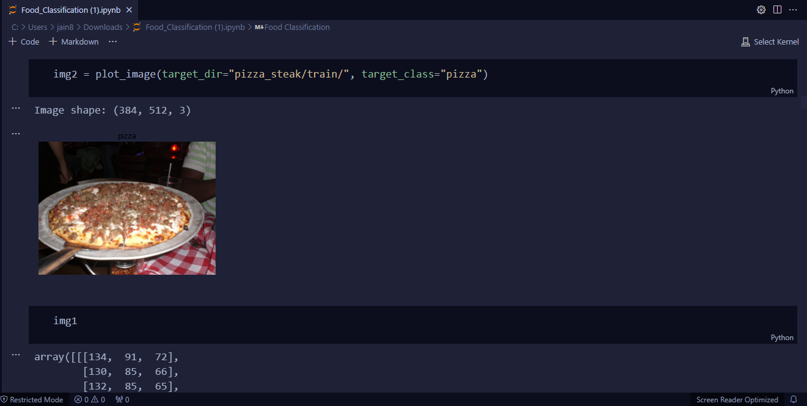
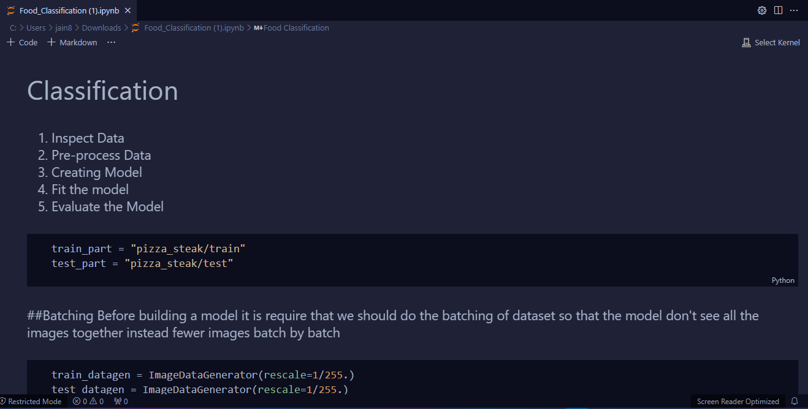
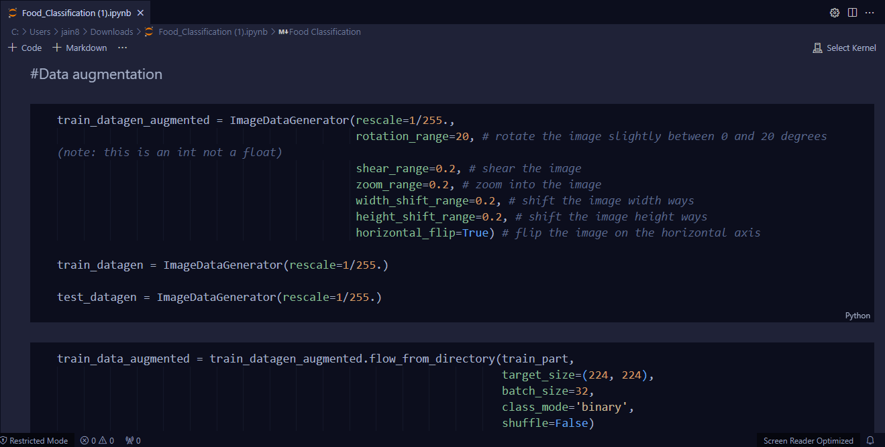
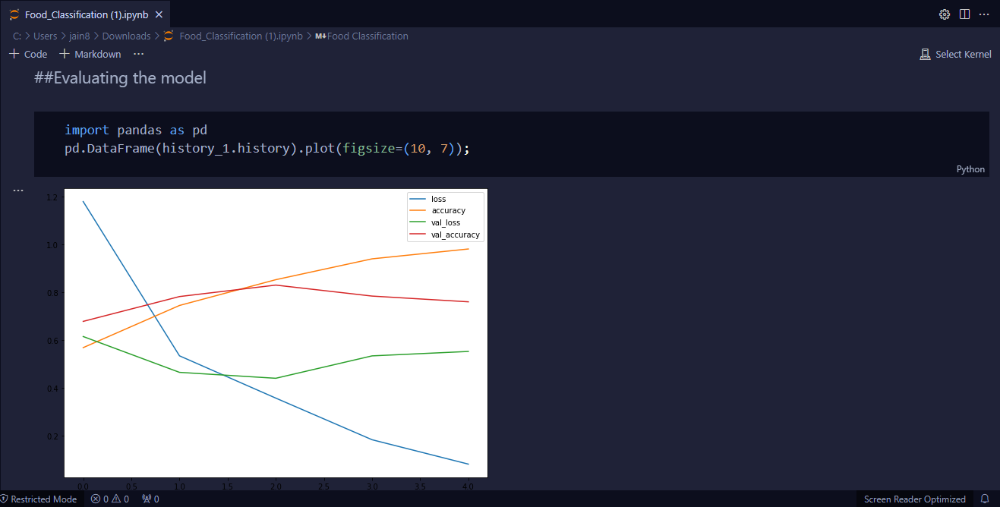
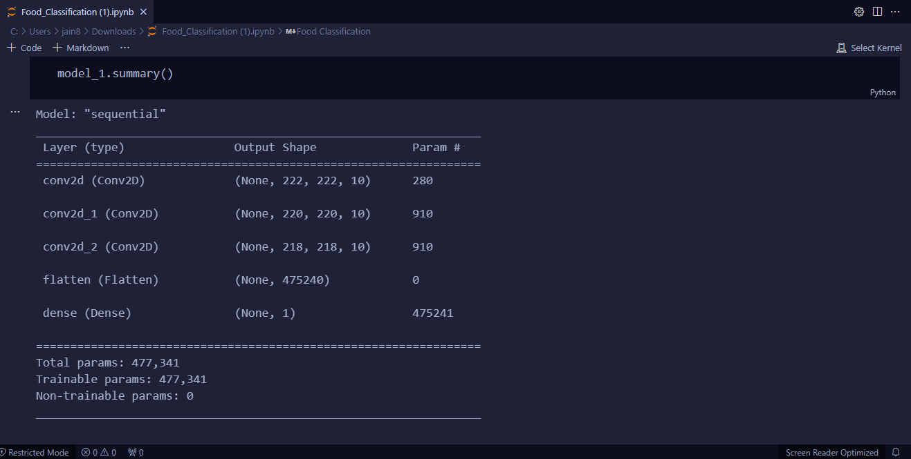
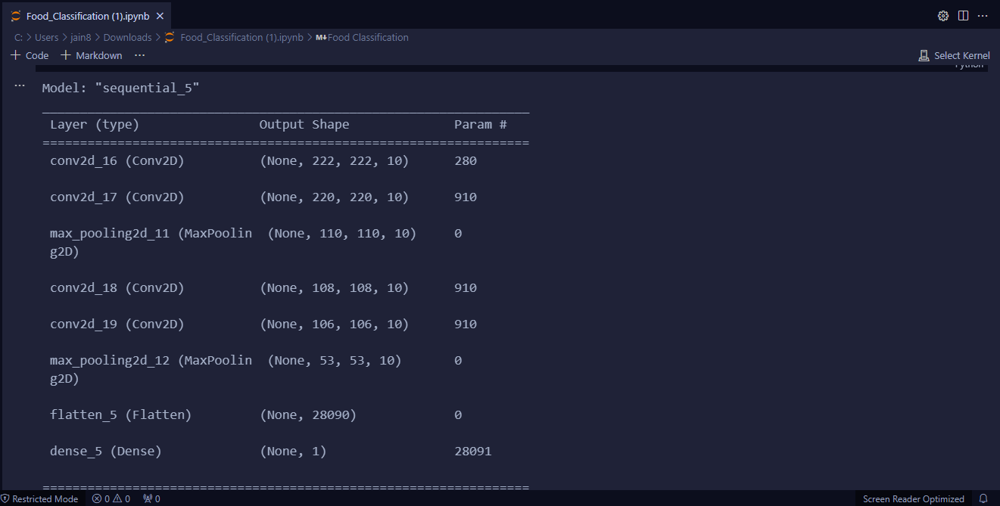
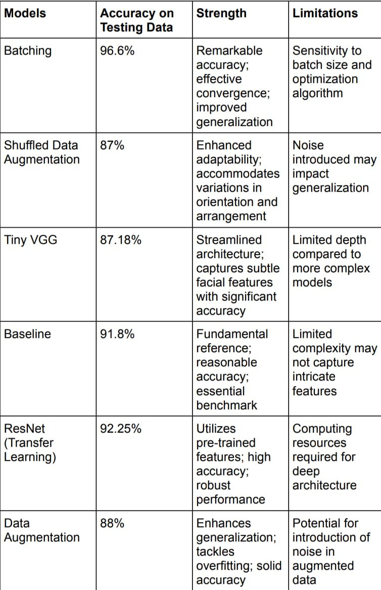

# Food Classification Project README

## **Overview**
This project delves into the realm of food image classification using deep learning techniques. It explores six different models, each with its own unique approach, to determine the most effective methods for accurate image classification.

## **Data Inspection and Visualization**
Understanding the dataset is crucial for effective model training. The project begins with a comprehensive inspection and visualization of the food images.

 
*Figure 1: Sample images from the dataset.*

## **Classification Pipeline**
The classification process is methodical, starting from data inspection, moving through preprocessing, model building, training, and finally evaluation.

 
*Figure 2: Classification pipeline.*

## **Detailed Model Descriptions**

### **1. Batching**
The "Batching" model emphasizes efficient data handling. It introduces the concept of processing the dataset in batches, reducing memory usage and potentially enhancing the model's ability to generalize. This approach is fundamental in training neural networks, especially when dealing with large datasets.

### **2. Data Augmentation**
"Data Augmentation" goes a step further by artificially expanding the dataset's diversity. This model employs techniques like rotation, flipping, and scaling to create variations of the training images. Such augmentation helps in improving the model’s robustness and ability to generalize, thereby reducing the risk of overfitting.

 
*Figure 3: Data augmentation code snippet.*

### **3. Tiny VGG**
The "Tiny VGG" model adapts the architecture of the well-known VGG network, simplifying it to suit our specific task. This model aims to capture the essence of deep learning architectures like VGG but with reduced complexity, offering a balance between performance and computational efficiency.

### **4. Baseline**
Serving as the cornerstone of the project, the "Baseline" model establishes the fundamental architecture and parameters. It sets the standard against which the improvements and efficiencies of other models are measured. This model is crucial for understanding the starting point of our deep learning journey.

### **5. ResNet (Transfer Learning)**
In the "ResNet" model, we leverage the power of transfer learning, utilizing a pre-trained ResNet architecture. This approach taps into the knowledge gained from large, diverse datasets, aiming to enhance accuracy and shorten training time for our specific food classification task.

### **6. Data Augmentation (Shuffled)**
Building upon the "Data Augmentation" model, "Data Augmentation (Shuffled)" introduces an additional layer of complexity by randomizing the order of the augmented data. This helps in ensuring that the model does not learn any potential sequence in the training data, further strengthening its generalization capabilities.

## **Model Evaluation and Architecture**
Each model's effectiveness is assessed using a combination of accuracy and loss metrics over training epochs.

 
*Figure 4: Model evaluation graph.*

### **Model Architectures**
The architectures of the "Batching" and "Data Augmentation (Shuffled)" models are showcased to provide insights into the structural differences and choices made in the models.

**Batching Model Structure**:
 
*Figure 5: Architecture of the Batching model.*

**Data Augmentation (Shuffled) Model Structure**:
 
*Figure 6: Architecture of the Data Augmentation (Shuffled) model.*

## **Comparative Analysis**
The models are compared based on their performance, highlighting strengths and limitations to provide a clear perspective on their applicability and effectiveness.

 
*Figure 7: Comparative analysis of the models.*

## **Conclusion**
The project showcases the iterative nature of machine learning and the impact of different modeling strategies on the task of food image classification. Each model offers unique insights and contributes to a deeper understanding of applying deep learning techniques in practical scenarios.
